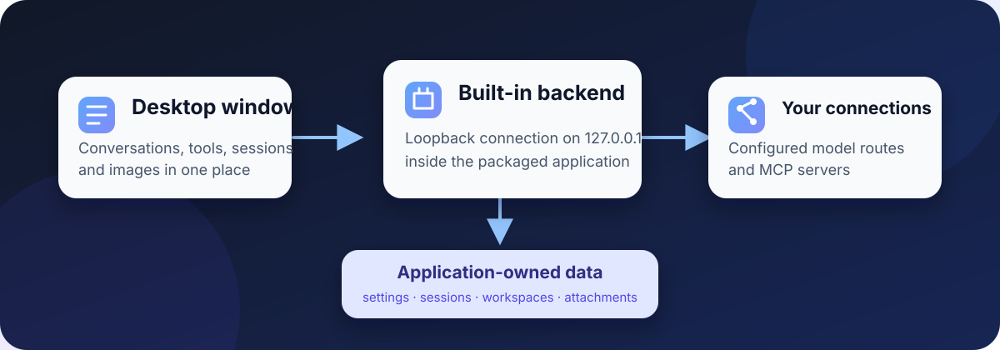

<p align="center">
  
</p>

# DeepSeek Harness Desktop

English | [中文](README.zh.md)

<p align="center">Conversations, tool activity, session history, and images in one desktop window.</p>

<p align="center"><a href="apps/desktop/README.md">Desktop guide</a> · <a href="https://github.com/Roc-Dove/deepseek-harness/actions/workflows/desktop-release.yml">Preview builds</a> · <a href="docs/development.md">Develop from source</a></p>

This community fork packages DeepSeek Harness as an installable desktop application. A packaged build includes Electron, the Harness backend, the Web UI, and the production dependencies they need. The application itself does not depend on a separate Node.js or pnpm installation, or on a source checkout.

<p align="center">
  
</p>

<p align="center"><sub>The desktop workspace keeps the session list, agent conversation, tool steps, and model controls together.</sub></p>

**Preview status:** There is no signed public installer yet. Current CI packages are unsigned evaluation builds, so macOS and Windows may warn about them or refuse to open them. The project is also in developer preview and may make compatibility-breaking changes.

## How the installed app starts

Opening an installed build starts its bundled backend on an ephemeral loopback address and loads the interface in one Electron window. The application creates its own data directory for settings, sessions, attachments, and its default workspace. It does not copy credentials, sessions, patches, or paths from the machine that built the installer.

The source development entry remains available for contributors, but installed builds do not run through a repository checkout and do not load local source patches.

## Control macOS apps

The preset picker includes **Computer use (macOS)**. It keeps the Standard mode coding tools and connects additional desktop-interaction tools after the user separately installs KimiCU in Applications and grants it Screen Recording and Accessibility access. KimiCU itself is not included in the Harness installer. The KimiCU 0.5.8 build verified for this integration is arm64-only and requires an Apple silicon Mac running macOS 14 or later.

Without KimiCU, the preset remains visible and its Standard mode tools still work, but no computer-control tools are registered. Restart Harness after installing KimiCU or changing its permissions. Calls made through the registered KimiCU tools require explicit Harness approval under an interactive approval policy. That prompt is not an operating-system sandbox around KimiCU or the Standard mode shell. The default DeepSeek route can use accessibility text but cannot visually inspect returned screenshots; image understanding requires an image-capable model route. See the [desktop guide](apps/desktop/README.md) for setup, data-flow, permission, and platform details.

## Return to archived work

Archiving removes a session from the active list without deleting its history. Open Settings to restore it, or restore and open it in one action. Archive changes are ordered across connected tabs so an older response cannot replace a newer state.

<p align="center">
  
</p>

<p align="center"><sub>Archived sessions remain available from Settings.</sub></p>

## Keep images in the conversation

Images remain visible in durable session history. A route that supports image input can receive them directly. For text-only routes, the optional Vision Bridge can save a controlled description beside each image before the request continues. Vision Bridge is disabled by default and requires an image-capable model route.

MCP tools can also return screenshots and generated images. The application validates accepted image bytes, stores them as attachments, and preserves their order in the tool result. A route that cannot receive the image gets explicit text instead of an unsafe attachment reference.

## What runs when you open it

<p align="center">
  
</p>

The desktop window and backend ship together. Model providers and MCP servers remain connections that the user chooses and configures. See the [desktop guide](apps/desktop/README.md) for installed data locations, startup behavior, navigation policy, and release verification.

<a id="run"></a>

## Get a preview build

The desktop workflow builds and smoke-tests native packages on each target platform:

| Platform | Evaluation package |
|---|---|
| macOS Apple Silicon | `macos-arm64` DMG and ZIP |
| macOS Intel | `macos-x64` DMG and ZIP |
| Windows x64 | `windows-x64` installer and ZIP |

Successful pull-request runs attach unsigned artifacts for evaluation. They expire according to GitHub Actions retention. Public downloads belong on the Releases page only after macOS signing and notarization, and Windows code signing, are configured.

<a id="run-from-source"></a>

## Develop from source

```sh
git clone https://github.com/Roc-Dove/deepseek-harness.git
cd deepseek-harness
pnpm install
pnpm run build
pnpm run desktop:dev
```

Source mode keeps local patch overlays and live-watch behavior for development. Read the [desktop guide](apps/desktop/README.md), [development guide](docs/development.md), and [architecture documentation](docs/architecture.md) before changing the runtime.

## Project and license

This repository is based on the open-source DeepSeek Harness originally developed by [DeepSeek AI](https://deepseek.com). Upstream project discussions remain at [deepseek-ai/deepseek-harness](https://github.com/deepseek-ai/deepseek-harness/discussions).

Contributions follow [CONTRIBUTING.md](CONTRIBUTING.md) and [AGENTS.md](AGENTS.md). The code is available under the [MIT License](LICENSE), and dependency licenses are listed in [THIRD_PARTY_NOTICES.md](THIRD_PARTY_NOTICES.md).
