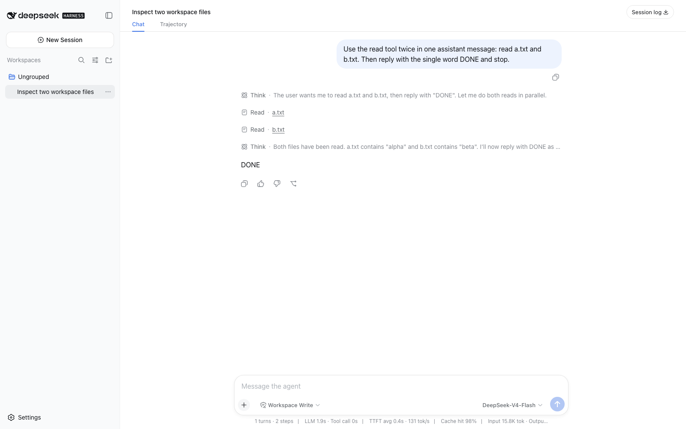
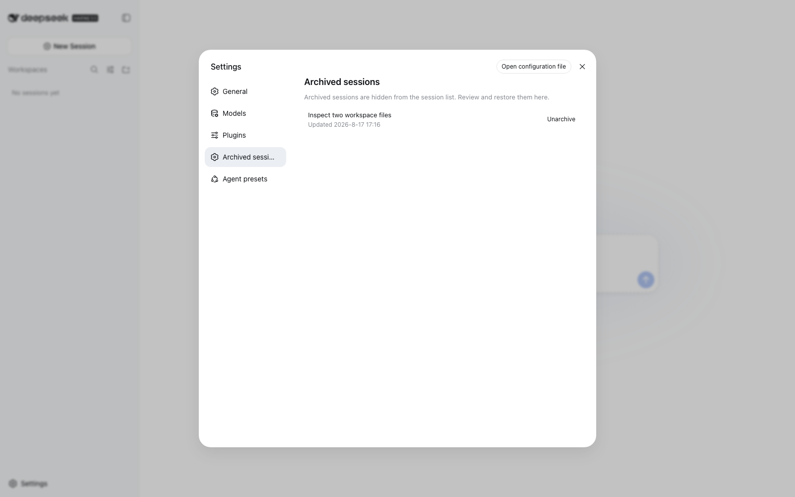
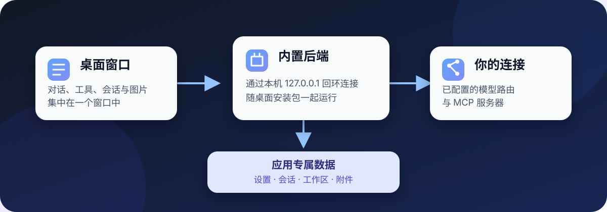

<p align="center">
  
</p>

# DeepSeek Harness Desktop

[English](README.md) | 中文

<p align="center">把对话、工具执行、会话历史与图片集中在一个桌面窗口中。</p>

<p align="center"><a href="apps/desktop/README.md">桌面指南</a> · <a href="https://github.com/Roc-Dove/deepseek-harness/actions/workflows/desktop-release.yml">预览构建</a> · <a href="docs/development.md">从源码开发</a></p>

这个社区 fork 把 DeepSeek Harness 打包为可安装的桌面应用。打包产物内含 Electron、Harness 后端、Web UI 及其生产依赖。应用本身不依赖另行安装的 Node.js 或 pnpm，也不依赖源码仓库。

<p align="center">
  
</p>

<p align="center"><sub>桌面工作区把会话列表、智能体对话、工具步骤与模型控制放在同一个窗口中。</sub></p>

**预览状态：** 当前还没有经过签名的公开安装包。CI 产物是未签名的评估版本，macOS 与 Windows 可能提示风险或拒绝打开。项目仍处于开发者预览阶段，后续可能出现破坏兼容性的变更。

## 安装版如何启动

打开安装版后，应用会在本机临时回环地址启动内置后端，并在一个 Electron 窗口中载入界面。应用会为设置、会话、附件与默认工作区创建自己的数据目录。安装包不会复制构建电脑上的凭据、会话、补丁或路径。

贡献者仍可使用源码开发入口，但安装版不会通过源码仓库运行，也不会加载本机源码补丁。

## 操作 macOS 应用

预设选择器随附**电脑操作**模式。它保留标准模式的编码工具；用户另行把 KimiCU 安装到“应用程序”，并为其开启“屏幕录制”和“辅助功能”权限后，该模式会再连接桌面操作工具。Harness 安装包不包含 KimiCU 本体。当前为这项集成验证的 KimiCU 0.5.8 只有 arm64 版本，需要运行 macOS 14 或更高版本的 Apple 芯片 Mac。

未安装 KimiCU 时，这个预设仍然可见，标准模式工具也可以继续使用，但不会注册电脑操作工具。安装 KimiCU 或修改权限后需要重启 Harness。在交互式审批策略下，经已注册 KimiCU 工具发起的调用需要用户在 Harness 中明确批准。这项提示不是围绕 KimiCU 或标准模式 Shell 的操作系统沙箱。默认 DeepSeek 路由能使用辅助功能文本，但不能直接理解返回的截图；视觉理解需要支持图片输入的模型路由。设置、数据流、权限与平台细节详见[桌面指南](apps/desktop/README.md)。

## 恢复归档会话

归档只会把会话移出当前列表，不会删除历史记录。你可以在设置中恢复会话，也可以恢复后直接打开。归档变更会在已连接的标签页之间有序同步，较旧响应不会覆盖较新的状态。

<p align="center">
  
</p>

<p align="center"><sub>归档会话仍可从设置中恢复。</sub></p>

## 让图片留在会话里

图片会保留在持久会话历史中。支持图片输入的模型路由可以直接接收图片。对于纯文本路由，可选的 Vision Bridge 会在继续请求前为每张图片生成受控描述，并把描述保存在图片旁边。Vision Bridge 默认关闭，启用前需要配置支持图片输入的模型路由。

MCP 工具也可以返回截图或生成图片。应用会校验允许接收的图片内容、保存为附件，并保留它们在工具结果中的顺序。无法接收图片的路由会获得明确文本，而不是不安全的附件引用。

## 打开应用后会运行什么

<p align="center">
  
</p>

桌面窗口与后端一起打包。模型服务商与 MCP 服务器仍由用户自行选择和配置。安装数据位置、启动行为、导航策略与发行验证详见[桌面指南](apps/desktop/README.md)。

<a id="run"></a>

## 获取预览构建

桌面 workflow 会在每个目标平台上构建原生产物并执行 smoke test：

| 平台 | 评估产物 |
|---|---|
| macOS Apple Silicon | `macos-arm64` DMG 与 ZIP |
| macOS Intel | `macos-x64` DMG 与 ZIP |
| Windows x64 | `windows-x64` 安装程序与 ZIP |

成功的拉取请求运行会附带未签名评估产物，这些文件会按 GitHub Actions 的保留期限过期。只有完成 macOS 签名与公证，以及 Windows 代码签名后，才能在 Releases 页面提供公开下载。

<a id="run-from-source"></a>

## 从源码开发

```sh
git clone https://github.com/Roc-Dove/deepseek-harness.git
cd deepseek-harness
pnpm install
pnpm run build
pnpm run desktop:dev
```

源码模式保留本机补丁覆盖与实时监听能力。修改运行时前，请先阅读[桌面指南](apps/desktop/README.md)、[开发指南](docs/development.md)与[架构文档](docs/architecture.md)。

## 项目与许可证

本仓库基于由 [DeepSeek AI](https://deepseek.com) 最初开发的开源 DeepSeek Harness。上游项目讨论仍位于 [deepseek-ai/deepseek-harness](https://github.com/deepseek-ai/deepseek-harness/discussions)。

参与贡献请遵循 [CONTRIBUTING.md](CONTRIBUTING.md) 与 [AGENTS.md](AGENTS.md)。代码采用 [MIT 许可证](LICENSE)，依赖许可说明见 [THIRD_PARTY_NOTICES.md](THIRD_PARTY_NOTICES.md)。
